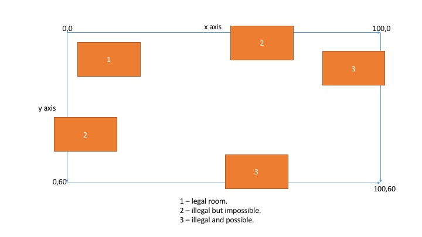
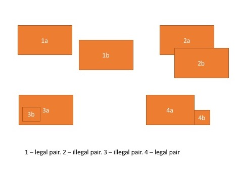
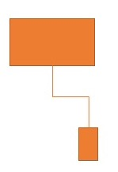
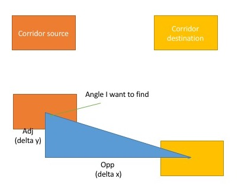
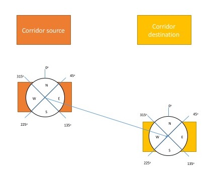
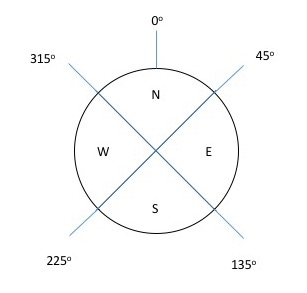
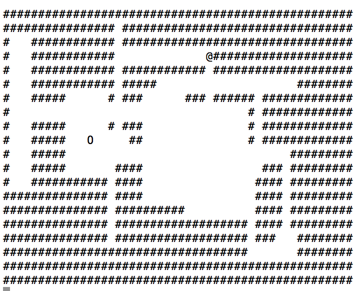
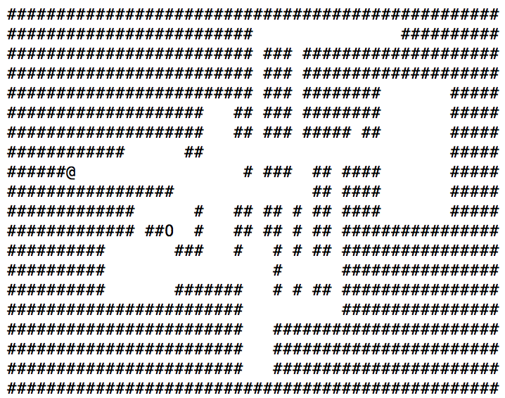
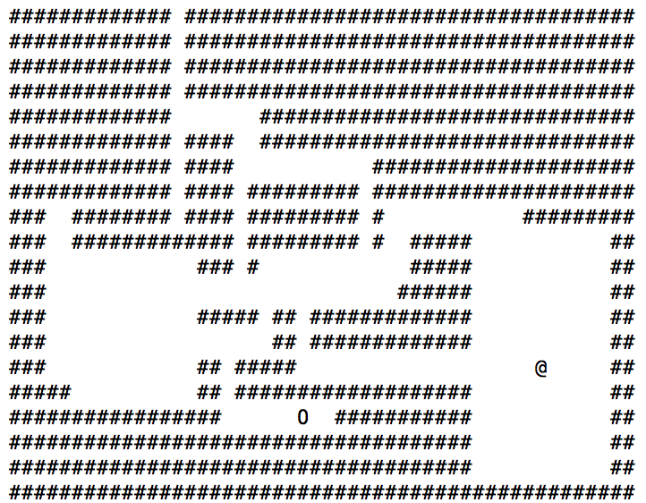

# Procedural Dungeon Generation

I did an r/dailyprogrammer challenge to create a game here: https://www.reddit.com/r/dailyprogrammer/comments/66p87v/20170421_challenge_311_hard_procedural_dungeon/ 

The first thing I did was decide on some requirements for my application

1. Each dungeon shall have an exit.
2. The dungeons shall not wrap around (the left edge doesnt turn into the right edge)
3. The player shall not move through walls.

*Pretty easy right? __Right!__*

I sort of envisioned something like this.

<ing src="intial_thoughts.jpg">

## Dungeon

Each dungeon consists of a number of rooms joined by a corridor. The maximum room size is a quarter of the dungeon, this is so that there is no chance of generating one room which is the size of the dungeon! 

The dungeon needs to have the following functionality:
* Add a new room
* Add an exit point
* Add a player
* Move the player
* Show the dungeon

### Dungeon Overview

The dungeon is initiased as a bunch of walls or `#`'s. The dungeon contains a map, which is a vector of vectors of `char`s. `std::vector<std::vector<char>> m_map;` It also contains a bunch of rooms `std::vector<room_t> m_rooms;`

### Add a Room

To add a room I first want to check that the room will fit within the dungeon. Then adding to a list of rooms, and finally joining the new room to the rest of them.

```c++
size_t dungeon_t::add_room(const room_t r)
{
	try
	{
		check_bounds(r);
		utilities_t::get().debug_print("Adding room");
		m_rooms.push_back( r );
		add_room_to_map( r );
		join_last_added_room();
	}
	catch(std::runtime_error &r)
	{
		utilities_t::get().debug_print(r.what());
	}
	return m_rooms.size();
}
```

#### Check Bounds

This is pretty simple - if the room's right edge is off the right edge off the map __OR__ the room's left edge is off the left edge of the map __OR__ the rooms top edge is off the top edge of the map __OR__ the rooms bottom edge is off the bottom edge of the map. 



Notice that if the room's top edge is off the top of the map, then it'll have a `-ve` value for it's y co ordinate and if the room's left edge is off the map then it'll also have a `-ve` value for it's co ordinate. Since I know that they will only ever be `+ve` integers I dont bother actually checking this bounds.

```c++
if( r.get_right_edge() >= m_map[0].size() ||
		r.get_bottom_edge() >= m_map.size() ) { throw  std::runtime_error("Room goes outside of dungeon"); }
```

As part of the check bounds function I also want to ensure that newly added room is going to be unique, rather than overlap into another room. This is just incase I have a big room created and a room plonked within that. 



```c++
bool dungeon_t::rooms_overlap( const room_t &first, const room_t &second ) const
{
	return (
			( second.get_left_edge() < first.get_right_edge() ) &&
			( second.get_right_edge() > first.get_left_edge() ) &&
			( second.get_top_edge() < first.get_bottom_edge() ) &&
			( second.get_bottom_edge() > first.get_top_edge() )
	);
}
```

### Add to Map

Adding to the map is the part which clears the walls in the room. Eg turns the dungeon from this:

```
##########
##########
##########
##########
```

Into this:

```
##########
####   ###
####   ###
##########
```

### Joining the Room

In order to get to the newly added room it is joined to the previous room in the room vector. This is performed by the `half_rjs`. 



The corridors are going to be straight with a line half way as shown. This is done by getting the centre of each room:

```c++
position_t from_centre = from.get_centre();
position_t to_centre = to.get_centre();
```

Then getting the relative direction of the newly added room - this is either `N S E or W`. 

#### Get Relative Direction

This method uses _maths_!.

```c++
room_join_strat_t::relative_direction_t room_join_strat_t::get_relative( const room_t &from, const room_t &to ) const
{
	// use trig to get polar angle
	const position_t from_p = from.get_centre();
	const position_t to_p = to.get_centre();
	const double d_x = to_p.get_x() - from_p.get_x();
	const double d_y = to_p.get_y() - from_p.get_y();
	const double theta_rads = atan( d_y / d_x );
	double theta_degs = theta_rads * 180 / M_PI;

	// make all the angles with reference to up
	// these are calculated by trial and error only rather than any maths
	if( d_x < 0 && d_y > 0 ) { theta_degs = 270 + theta_degs; }
	if( d_x > 0 && d_y > 0 ) { theta_degs += 90; }
	if( d_x < 0 && d_y < 0 ) { theta_degs += 270; }
	if( d_x > 0 && d_y < 0 ) { theta_degs += 90; }
	theta_degs = fmod( theta_degs, 360.0 );

	std::stringstream ss;
	ss << "From " << from_p.get_x() << ", " << from_p.get_y() << " to " << to_p.get_x() << ", " << to_p.get_y() << " is an angle of " << theta_rads << " [" << theta_degs << "]";
	utilities_t::get().debug_print(ss.str());

	// roughly split into a direction based on the angle
	if( theta_degs >= 45.0 && theta_degs < 135.0 ) { return E; }
	if( theta_degs >= 135.0 && theta_degs < 225.0 ) { return S; }
	if( theta_degs >= 225.0 && theta_degs < 315.0 ) { return W; }
	return N;

}
```

First off the `SOHCAH__TOA__` is used to find the angle from the source room to the dest room in degrees.



Then this is converted (using values found from trial and error) into an angle with respect to up.



Then finally turned into a direction.

.

#### Drawing Corridors

The corridors are drawn in three parts based on the relative direction of the destination room.

```c++
switch(dir)
{
	case W:
		swap(from_centre, to_centre);
	case E:
		draw_horizontal(from_centre.get_y(), from_centre, change_point, map);
		draw_vertical(change_point.get_x(), from_centre, to_centre, map);
		draw_horizontal(to_centre.get_y(), change_point, to_centre, map);
		break;
	case N:
		swap(from_centre, to_centre);
	case S:
		draw_vertical(from_centre.get_x(), from_centre, change_point, map);
		draw_horizontal(change_point.get_y(), from_centre, to_centre, map);
		draw_vertical(to_centre.get_x(), change_point, to_centre, map);
		break;
}
```

This is fairly self explainatory I think, it draws a line from the source room to the mid point, then draws a perpendicular line till it's at the destination mid point. Then completes the pathway to the centre.

### Add a Player

A player (shown by the `0` icon) is plonked in the centre of the first room created.

### Create an exit

This is another fairly simple method:
1. Choose a Room
2. Get the centre of it
3. Make that the exit 

```c++
void dungeon_t::create_exit( void )
{
	// Create an exit in the middle of one of the rooms
	int rand_room = utilities_t::get().get_rand_in_range(m_rooms.size()-1);
	room_t& r = m_rooms[rand_room];
	position_t c = r.get_centre();
	m_exit_location = c;
	m_map[m_exit_location.get_y()][m_exit_location.get_x()] = '@';

}
```

### Example Dungeons







## Game Loop

The main game loop is something like this:
1. Get user input
2. Try to move the player
3. Check for escape found
4. Show the new dungeon

```c++
		char inp;
		std::cin >> inp;

		while(inp != 'q')
		{
			switch(inp)
			{
				case 'a': //left
					p1.position().set_x(p1.get_x() - 1);
					break;
				case 's': //down
					p1.position().set_y(p1.get_y() + 1);
					break;
				case 'd': //right
					p1.position().set_x(p1.get_x() + 1);
					break;
				case 'w': //up
					p1.position().set_y(p1.get_y() - 1);
					break;
				default:
					break;
			}
			p1.position() = dung.update_player_position(p1.position());

			if( dung.player_has_found_exit() )
			{
				std::cout << "ESCAPE!" << std::endl;
				break;
			}
			dung.show();

			std::cin >> inp;
		}
	
```

# Things To Improve
* It'd be awesome to have a better GUI
* I haven't used it enough to find the bugs during use
* Have a different way of joining the rooms together