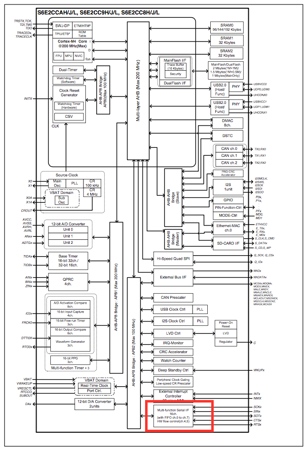
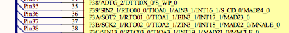
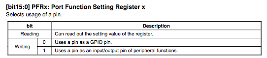
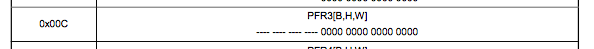
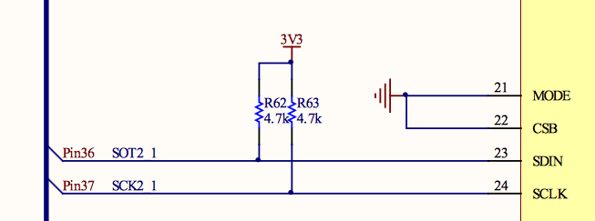
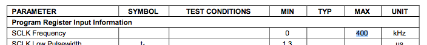

#MFS-I2C Setup

## I2C Initialise

In order to communicate using I2C the FM4's MFS peripheral is used. Which can talk using loads of different protocols and we need to set it up correctly.



The example project doesn't use the PDL, so it manipulates the registers directly - I suppose this prevents a bloated codebase?

With any microcontroller the first thing I would expect to happen in an intialisation routine is for the pins to be correctly set up - In/Out/PullUp/PullDown ...

### Pin Setup

On the FM4 dev kit the control register pins are labelled as SOT2_1 and SCK2_1 (pins 36 and 36)


which on the MCU are associated with Port 3 pins A and B



According to the FM4 peripheral datasheet the **PFR** register determines whether the pin is being used as GPIO or by a peripheral,



so I would expect that those 2 pins at some point would have a value of 1 written to the the PFR3 register in the relevant bits.



and viola! It does this by using the macro `bFM4_GPIOPRF3_PA = 1u`. *Using what I learned about the bit Band Aliasing (and my [nifty converter](bbaregion.c)) I expect this to translate to `0x42de01a8`, and confirming it using `s6e2ccxj.h` line 69898 it says `#define bFM4_GPIO_PFR3_PA *((volatile  uint8_t *)(0x42DE01A8UL))`*

Then it enables the pin on the peripheral side by using the **E**xtended **P**eripheral **F**unction **R**egister. A quick `ctrl-f` for the function `SOT2_1` quickly finds in the document the EPFR Settings Register 07. This tells me that Bits 19 and 18 need to be set to `b10` to use `SOT2_1`. So the bit 19 needs to be `1` and 18 needs to be `0`.

Another thing to note in the schematics is that the Control lines are pulled up for some resistors.



*Why is this significant?* well it affects the voltage available the line when it's not driven by one of the devices. It needs to be configured as an **open drain** aka when the pin state is '1' this is provided by the pull ups. 

If I go back to the contents of the peripherals datasheet a quick scan tell me to go to the section about *Port Pseudo Open Drain Setting Register*. Again, `Port 3` is what the SOT2_1 aka I2C SDA is connected to, so I want to use the Alias Region to set the relevant bit.

> The [example project](example_project) actually uses a generic [`s6e2cc.h`](example_project/s6e2cc.h) header file rather than use the [previously discussed](../gpio_use/index.md) PDL. It uses structs to manipulate the bits directly rather than use the Alias Region

```c
// In PDL language this would be bFM_GPIO_PZR3_PA = 1u;
FM4_GPIO->PZR3_f.PA = 1u; // SDA to pseudo open drain
```

> Strictly speaking in PDL language I would use the provided `Mfs_I2c_Init` function to abstract all knowledge of the registers away

Now that my pins to control the Codec are setup:
* To be used by their peripheral function
* The peripheral function knows that it's setup that way
* The open-drain is setup

I can actually configue the communications protocol settings.

## MFS Setup

### Mode Selection

The FM4's MFS has to be told what protocol it's using which is done by the Serial Mode Register `SMR`. In the [comms datasheet](http://www.cypress.com/file/222976/download) it says the bits 7:5 need to be `100` to enable I2C. I also know that I'm not going to need any Interrupts on Tx or Rx, since there is only one slave, and the communications is only on setup of the codec. 

`SMR = 0b1000000 = 0x80`

### Clock Selection

As shown in [this bit](../clocks/index.md) the clock to the MFS device is 100MHz. The codec datasheet says that the SCLK value should be 400kHz, aka [full speed I2C](https://www.i2c-bus.org/speed/), along with the fact that it's the slave on the bus. 



As the codec is the slave, then the FM4 is the master so it must generate SCK. Fortunately the [comms datasheet](http://www.cypress.com/file/222976/download) has Table 3-1 which tells me which value to use in the I2C **Dedicated Baud Rate Generator** and that is `249`.

This is split across 2 registrs `BGR1` and `BGR0`. 

```
// Also sets the Baud Rate Generator Clock to be the 100MHz one from the APB2 bus
BGR1 = 0x00;
BGR0 = 0xF9;
```

At this point I also need to tell the I2C device that it's the master. This is done in the I2C Bus Control Register `IBCR` bits 15 and 14. I also want to disable all the other interrupts while I'm in this register.

`IBCR = 0b10000000`

> The [example](example_project/i2c.c) also sets the MFS Reset Bit after this setup. But I can't find anything in the [comms datasheet](http://www.cypress.com/file/222976/download) to support this yet.