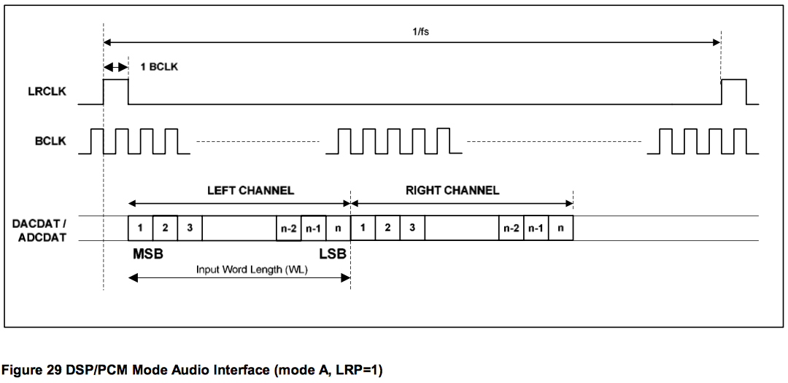

# Codec Settings

[The codec datasheet](https://www.rockbox.org/wiki/pub/Main/DataSheets/WM8731_8731L.pdf) has a list of the control registers. 
> Interestingly the [example project initialisation](example_project/audio.c) for the codec doesn't match to this, at least in the comments. The process below is as per the datasheet and values written rather than the comments.

## Setup Process

1. Reset the Codec
2. Set L and R lines to `mute disabled` `+3db gain` `simultaenous load disabled`
3. Set L and R volumes to `-10dB`
4. Set the ADC to get it's input from either MIC or Line In
5. Set the Line Out/Headphones to come from the DAC
6. Turn off all the internal filters and make sure nothing is muted
7. Make sure no power saving features are turned on
8. Configure the Digital Interface
* Set up the Digital output to DSP mode
* Set up the Digital output to 16 bits
* Ensure that Left = Left and Right = Right
* Set the codec to generate the clocking signals etc
* Use the first clock signal after the rising edge on the DACLRC line
9. Set the Sample Frequency
10. Activate the digital interface!

There are a lot of settings! But once I got more familiar with the datasheet for the codec they made sense. The L and R channels have to be told how loud to be (steps 2 and 3), then you have to tell it where to get it's input (step 4) and where to get the output from (step 5). You also need to tell it which of the filters you want it to use (step 6) and then tell it how it's going to send it's output data (step 8).

> ```c
> Codec_WriteRegister ( WM8731_RESET, 0x00);   			
> Codec_WriteRegister ( WM8731_LLINEIN, 0x19); 			
> Codec_WriteRegister ( WM8731_RLINEIN, 0x19); 			
> Codec_WriteRegister ( WM8731_LHEADOUT, 0x6F);			
> Codec_WriteRegister ( WM8731_RHEADOUT, 0x6F);			
> Codec_WriteRegister ( WM8731_ANALOG, audio_input); 		
> Codec_WriteRegister ( WM8731_DIGITAL, 0x00); 			
> Codec_WriteRegister ( WM8731_POWERDOWN, 0x00); 			
> Codec_WriteRegister ( WM8731_INTERFACE, 0x53); 			
> Codec_WriteRegister ( WM8731_SAMPLING, sampling_rate);
> Codec_WriteRegister ( WM8731_CONTROL, 0x01); 	
> ```		

In the diagram below the output side of the codec is ignored.


## I2S Communication Mode 

The mode setup above is pretty interesting - it means that it'll take the input signal and output, via a serial connection, the audio data.

In DSP mode the codec can output 32bits per channel, per sample! So if a sample happened every 32 seconds, a bit would be sent to the FM4 every half a second (because there is a Left and a Right channel) `32 seconds / 64 bits = 1/2`. The start of each set of 64 bits is signaled by a pulse on the `LRCLK` line. And a bit is read by the FM4 on every rising edge of the `BLCK` line.



Lets recap that - 64 bits of data need to be sent per sample of the input signal. As each databit is clocked into the FM4 on a rising edge on the `BCLK` line we need to be aware of the `BCLK` rate/frequency. The [codec Datasheet](https://www.rockbox.org/wiki/pub/Main/DataSheets/WM8731_8731L.pdf) says that

> In Master mode, DACLRC and ADCLRC will be output with a 50:50 mark-space ratio with BCLK output at 64 x base frequency (i.e. 48 kHz).

It follows that the `BCLK` freq is 

```
48kHz x 64 = 3072kHz = 3.072MHz
```

which means that: 

| BCLK Freq | Sample Rate | Number of BCLK pulses per LRCLK pulse |
| ---  | --- | --- |
| 3072e3 | 96e3 | 3072 / 96 = 32 |
| 3072e3 | 48e3 | 3072 / 48 = 64 |
|3072e3 | 32e3 | 3072 / 32 = 96 |
|3072e3 | 8e3 | 3072 / 8 = 384 |

In the table the maximum number of bits which can be sent for every sample rate is 32, when the sample rate is 96kHz. In the FM4 the word size is 32 bits so it's actually pretty convenient to only get 32 bits from the ADC in total. In cases where the sample rate is different, the leftover bits after the 32 are packed with zeros.


The line of code in the example project sets it up as 32 bits.

> `Codec_WriteRegister ( WM8731_INTERFACE, 0x53);`