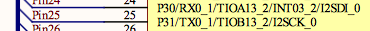

# I2S Peripheral Setup

The important thing to remember is to enable the clock to the peripheral before trying to use it. This is the same in many micro controllers. The example project uses

> `bFM4_CLK_GATING_CKEN2_I2SCK0 = 1u;`

however the PDL also provides the `I2s_StartClk()` function.

## Pins

Now that the control interface to the codec, and the codec's I2S settings are sorted we need to sort out the FM4. The bit what receives the data from the codec.

If I consult the schematic I can see that the I2S pins are connected to something called `I2SCK_0 I2SDO_0 I2SDI_0 I2SWS_0` so my guess is that it's the I2S peripheral number 0.



| Function | Pin | Port/Pin |
| ---| --- | --- |
| I2SDO | 42 | 5:E |
| I2SWS | 43 | 5:F |
| I2SMCLK | 41 | 5D |
|I2S DI | 24 | 3:0 |
| I2SCK | 25 | 3:1 |

And in the [serial datasheet](http://www.cypress.com/file/222976/download) and the [peripheral datahsheet](http://www.cypress.com/file/222996/download) a `ctrl-f` for `I2SDO0` yields some results. 

In the same way as setting up the I2C above the [i2s setup](example_project/i2s.c) sets those pins to use their peripheral function, and then enabled that peripheral function as well using the **PFR** and **EPFR** registers.

> ```c
> // Pin configuration
> FM4_GPIO->EPFR24 |= (1ul << 2ul);    // I2S0-MCLK pin to input
> bFM4_GPIO_PFR5_PD = 1u;
>
> FM4_GPIO->EPFR24 |= (1ul << 10ul);   // I2S0-DO pin to output
> bFM4_GPIO_PFR5_PE = 1u;
>	
> FM4_GPIO->EPFR24 |= (1ul << 8ul);    // I2S0-DI pin to input   
> bFM4_GPIO_PFR5_PE = 1u;
>
> FM4_GPIO->EPFR24 |= (1ul << 4ul);    // I2S0-CK pin to input/output (input used)
> bFM4_GPIO_PFR3_P1 = 1u;
>
> FM4_GPIO->EPFR24 |= (1ul << 6ul);    // I2S0-WS pin to input/output (input used)
> bFM4_GPIO_PFR5_PF = 1u;
> ```


Now that the pins are setup for the peripheral the actual peripheral itself needs to be setup, to match those settings we sent to the codec above. Going through the example project. Since the MFS is being used already we will be using the I2C dedicated peripheral.


The first setting is to turn off the I2S clock - remember how the codec is providing the clock. Again, searching through the datasheet for the serial comms the _I2S Clock Control Register_ comes up, and in it bit 0 `I2SEN` controls this.

> ```c   bFM4_I2SPRE_ICCR_ICEN =0u;	// Disables I2S MCLK output. The clock will be generated by the CODEC.```

I used used my calculator to check that the memory location which `bFM4_I2SPRE_ICCR_ICEN` points to is this bit - it is `0x427A0000`.

While configuring the I2S stop all the Tx and Rx operations using the `OPREG` or _Operation Control Register_ detailed in Chapter7-2 section 6.7 of the communications datasheet.

> ```c FM4_I2S0->OPRREG_f.START = 0u;       // Stops the I2S interface while configuring. ```

The next thing is that the since the codec is providing our `MCLK` we need to set the FM4's I2S `MCLK` source to the correct frequency using the I2S `CNTREG` (Control register not Cunt register!) `CKRT` bits.

> ```c FM4_I2S0->CNTREG_f.CKRT  = 0u;       // 0: Bypass: Use Wolfson clock ```

The example project also then uses the OVHD bits of the I2S control register to set the amount of padding in the sent data to from the FM4 to the codec. This is basically the number of spare `BCLK` pulses per sample. Remember above when the [communication mode was set to 32bits](codec_setup.md) using this line of code?

> `Codec_WriteRegister ( WM8731_INTERFACE, 0x53);`

Using the formula `( BCLK_freq / sample_rate ) - number_of_bits_per_sample` we can get the number of padded `0's`

```
BCLK_freq = 3072e3. number_of_bits_per_sample = 32.
(3072e3 / 96e3) - 32  = 0
(3072e3 / 48e3) - 32  = 32
(3072e3 / 32e3) - 32  = 64
(3072e3 / 8e3) - 32  = 352
```

Therefore: 

> ```c
> //Overhead bits
>   if (sampling_rate == hz8000) FM4_I2S0->CNTREG_f.OVHD  = 352;     
>   if (sampling_rate == hz32000) FM4_I2S0->CNTREG_f.OVHD  = 64;     
>   if (sampling_rate == hz48000) FM4_I2S0->CNTREG_f.OVHD  = 32;     
>   if (sampling_rate == hz96000) FM4_I2S0->CNTREG_f.OVHD  = 0;  
> ```

The next chunk of code is fairly self explainatory - refer to p881 onwards of the [datasheet](http://www.cypress.com/file/222976/download) and it sets up the following configuration:
* In the case of no data in the Transmit buffer send `0s`
* The FM is the slave.
* There is only one subframe
* Split the contents of the transmit buffer into two separate 16 bits rather than one long 32 bit word. 
* On recieve combine the 16bit left anf 16bit right channels into one 32 bit register
* set master mode clock to use internal clock source (not used)
* Fill any remaing space in the recieved data register with 0's (not used)
* Don't just send data unless I say
* Send the MSB first
* Sample the serial data in the middle
* Use the rising edge of `BCLK` to trigger a read of the serial data
* LRCLK pulse happens at the same time as sending the first bit
* The `LRCLK` will be high for the whole of the left channel **I believe this is in error further tinkering required**
* The `LRCLK` is active high aka 1 means 1

> ```c
> FM4_I2S0->CNTREG_f.MSKB  = FALSE ;   // No mask bit
>   // Master - Slave configuration 
>   FM4_I2S0->CNTREG_f.MSMD  = FALSE ;   // Slave mode
>   // Number of Subframe constructions
>   FM4_I2S0->CNTREG_f.SBFN  =  FALSE ;  // 1 Subframe ; 2 channels on the same subframe. 
> 	// Word construction of FIFO 
>   FM4_I2S0->CNTREG_f.RHLL  = TRUE ;    // two 16 channels combined into a 32-bit FIFO word    
> 	//Base clock divider (in master mode)
> 	FM4_I2S0->CNTREG_f.ECKM = FALSE;
>   // Bit extension
>   FM4_I2S0->CNTREG_f.BEXT  = FALSE ;   // Bit extension not used
>   // Output Mode of Frame Synchronous Signal
>   FM4_I2S0->CNTREG_f.FRUN  = FALSE;    // Don't start free running
>   // Shifting order
>   FM4_I2S0->CNTREG_f.MLSB  = FALSE;    // Shift starts from MSB of word 
>   // Sampling point of data reception
>   FM4_I2S0->CNTREG_f.SMPL  = FALSE;    // Sampling is performed in the middle of the receive data.
>   // Clock polarity
>   FM4_I2S0->CNTREG_f.CPOL  = TRUE;     // Drives data at the falling edge of I2SCK and is sampled at the rising > edge of I2SCK. 
>   // Frame Sync Phase
>   FM4_I2S0->CNTREG_f.FSPH  = FALSE;    // I2SWS is enabled at the same time as the frame data and first bit. 
>   // Frame Sync Pulse Width
>   FM4_I2S0->CNTREG_f.FSLN  = TRUE;     // Pulse width will be one channel length (1 channel).
>   // Frame Sync Polarity
>   FM4_I2S0->CNTREG_f.FSPL  = FALSE;    // I2SWS is "1", and the frame sync signal is enabled. This is "0" when > idle.
> ```

Since the FM4 can have lots of information sent over I2S each individual frame and sub frame has to be specified. This is setup as follows:
* 2 channels (left and right)
* Each channel has 16 bits
* The 16 bits from 1 word which is 16 bits long
* enable channels 1 and 2

> ```c
>// Configuration for Sub Frame 0
>  FM4_I2S0->MCR0REG_f.S0CHN  =  1u ;   //Number of channels -1 for subfram_0 (two channels)
>  FM4_I2S0->MCR0REG_f.S0CHL  =  15u;   //Bit length -1 of the channels that make up subframe 0 (32bit)
>  FM4_I2S0->MCR0REG_f.S0WDL  =  15u;   //Word length - 1.
>
> // Set active channels for Sub Frame 0   
>  FM4_I2S0->MCR1REG  = 0x00000003u;    // Enable channel 0 and 1 in subframe 0
> ```

And finally the Tx and Rx interrupts are setup. When a bit is masked this means that the interrupt associated with it is disabled. So in order to only enable interrupt to the DMA or on a full FIFO buffer these bits must be `FALSE` and all the rest need to be set to `TRUE`.

>```c
>// Transmit interrupt settings
>  FM4_I2S0->INTCNT_f.TXUD0M = TRUE;
>  FM4_I2S0->INTCNT_f.TXUD1M = TRUE;
>  FM4_I2S0->INTCNT_f.TBERM  = TRUE;
>  FM4_I2S0->INTCNT_f.TXOVM  = TRUE;
>  if (mode == intr)FM4_I2S0->INTCNT_f.TXFDM  = TRUE;
>	else if (mode == dma)FM4_I2S0->INTCNT_f.TXFDM  = FALSE; //A DMA request is made when the receive dat written >to the transmit FIFO meets or exceeds the threshold value.
>  if (mode == intr) FM4_I2S0->INTCNT_f.TXFIM  = FALSE;    //An interrupt is issued to the CPU when the transmit >FIFO empty space meets or exceeds the threshold value
>	else if (mode == dma)FM4_I2S0->INTCNT_f.TXFIM  = TRUE;
>	FM4_I2S0->INTCNT_f.FERRM  = TRUE;
>```

The same for Rx, do I want a DMA interrupt when the FIFO is full - if so then don't mask this bit.

> ```c
> // Recive interrupt settings
>  FM4_I2S0->INTCNT_f.RBERM  = TRUE; 
>  FM4_I2S0->INTCNT_f.RXUDM  = TRUE; 
>  FM4_I2S0->INTCNT_f.RXOVM  = TRUE;
>  if (mode == intr)FM4_I2S0->INTCNT_f.RXFDM  = TRUE;
>	else if (mode == dma)FM4_I2S0->INTCNT_f.RXFDM  = FALSE; //A DMA request is made when the receive data written >to the transmit FIFO meets or exceeds the threshold value.
>  FM4_I2S0->INTCNT_f.EOPM   = TRUE;
>  FM4_I2S0->INTCNT_f.RXFIM  = TRUE; 
>	FM4_I2S0->INTCNT_f.RPTMR  = 0x0;  
>```

Interestingly the configuration above has potential for absolutely no interrupts on Rx of data from the Codec. It looks as if when the I2S peripheral is enabled it automatically pumps out 32 bits of `0s`. Once this has been sent an interrupt is triggered - it just so happens that this interrupt handler reads from the Rx FIFO then writes some other data to the Tx FIFO. Since the communications is fixed and predictable and relatively simple this is a pretty simple way of implementing it I think.

### Resources
* [DSP Mode](http://www.nxp.com/assets/documents/data/en/application-notes/AN3664.pdf)
* [Codec Datasheet](https://www.rockbox.org/wiki/pub/Main/DataSheets/WM8731_8731L.pdf)