# Audio on the FM4

> In this bit code snippets in these quote blocks are taken from the [example project](example_project).

According to the FM4 datasheet the headphone jack on the dev kit is connected to an Audio Codec. It's the codec's job to turn sounds (analogue signals) into data for the S6E2CC core, and vice versa. The codec on the dev kit is a WM8731, manufactured by Wolfson.

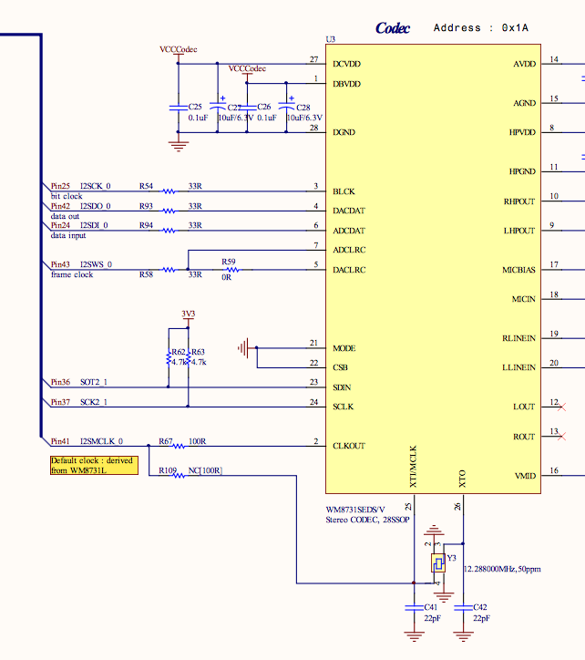

## Example Project

I have used the reference project provided by ARM University and used this as a starting point to see what they do. This can be found in [here](example_project).

The project's main basically does the following things:
1. Setup the audio codec
2. Nothing

It seems abit too simple to me so I thought I'd investigate it to understand what's happening. 

## Set Up the Audio Codec
The [main](example_project/fir_intr.c) calls the function `audio_init` which is implemented in [audio.c](example_project/audio.c). The first thing this does is to initialese the I2C, why does it do this? 

Well if we examine the datasheet codec it tells us in the *Software Control Interface* section that this is achievied using the SDIN pin. Also, on the schematic we notice that the MODE and CSB pins are grounded on the development kit.

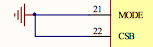

And in the datasheet for the codec is says that those pins correspond to how the control registers are written to, I2C vs SPI and it's address.

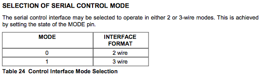

So we are using I2C.

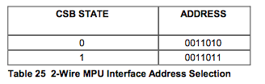

at address `0x1A`

### I2C Initialise

In order to communicate using I2C the FM4's MFS peripheral is used. Which can talk using loads of different protocols and we need to set it up correctly.


The example project doesn't use the PDL, so it manipulates the registers directly - I suppose this prevents a bloated codebase?

With any microcontroller the first thing I would expect to happen in an intialisation routine is for the pins to be correctly set up - In/Out/PullUp/PullDown ...

#### Pin Setup

On the FM4 dev kit the control register pins are labelled as SOT2_1 and SCK2_1 (pins 36 and 36)

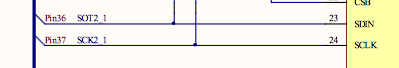

which on the MCU are associated with Port 3 pins A and B

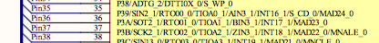

According to the FM4 peripheral datasheet the **PFR** register determines whether the pin is being used as GPIO or by a peripheral,

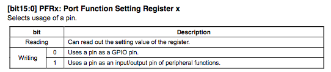

so I would expect that those 2 pins at some point would have a value of 1 written to the the PFR3 register in the relevant bits.

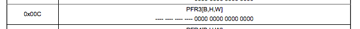

and viola! It does this by using the macro `bFM4_GPIOPRF3_PA = 1u`. *Using what I learned about the bit Band Aliasing (and my [nifty converter](bbaregion.c)) I expect this to translate to `0x42de01a8`, and confirming it using `s6e2ccxj.h` line 69898 it says `#define bFM4_GPIO_PFR3_PA *((volatile  uint8_t *)(0x42DE01A8UL))`*

Then it enables the pin on the peripheral side by using the **E**xtended **P**eripheral **F**unction **R**egister. A quick `ctrl-f` for the function `SOT2_1` quickly finds in the document the EPFR Settings Register 07. This tells me that Bits 19 and 18 need to be set to `b10` to use `SOT2_1`. So the bit 19 needs to be `1` and 18 needs to be `0`.

Another thing to note in the schematics is that the Control lines are pulled up for some resistors.

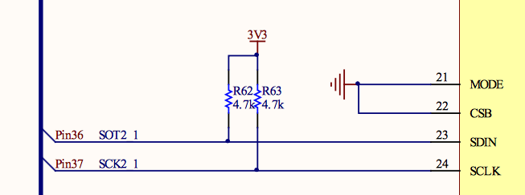

*Why is this significant?* well it affects the voltage available the line when it's not driven by one of the devices. It needs to be configured as an **open drain** aka when the pin state is '1' this is provided by the pull ups. 

If I go back to the contents of the peripherals datasheet a quick scan tell me to go to the section about *Port Pseudo Open Drain Setting Register*. Again, `Port 3` is what the SOT2_1 aka I2C SDA is connected to, so I want to use the Alias Region to set the relevant bit.

> The [example project](example_project) actually uses a generic [`s6e2cc.h`](example_project/s6e2cc.h) header file rather than use the [previously discussed](../gpio_use/index.md) PDL. It uses structs to manipulate the bits directly rather than use the Alias Region

```c
// In PDL language this would be bFM_GPIO_PZR3_PA = 1u;
FM4_GPIO->PZR3_f.PA = 1u; // SDA to pseudo open drain
```

> Strictly speaking in PDL language I would use the provided `Mfs_I2c_Init` function to abstract all knowledge of the registers away

Now that my pins to control the Codec are setup:
* To be used by their peripheral function
* The peripheral function knows that it's setup that way
* The open-drain is setup

I can actually configue the communications protocol settings.

### MFS Setup

#### Mode Selection

The FM4's MFS has to be told what protocol it's using which is done by the Serial Mode Register `SMR`. In the [comms datasheet](http://www.cypress.com/file/222976/download) it says the bits 7:5 need to be `100` to enable I2C. I also know that I'm not going to need any Interrupts on Tx or Rx, since there is only one slave, and the communications is only on setup of the codec. 

`SMR = 0b1000000 = 0x80`

#### Clock Selection

As shown in [this bit](../clocks/index.md) the clock to the MFS device is 100MHz. The codec datasheet says that the SCLK value should be 400kHz, aka [full speed I2C](https://www.i2c-bus.org/speed/), along with the fact that it's the slave on the bus. 

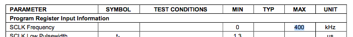

As the codec is the slave, then the FM4 is the master so it must generate SCK. Fortunately the [comms datasheet](http://www.cypress.com/file/222976/download) has Table 3-1 which tells me which value to use in the I2C **Dedicated Baud Rate Generator** and that is `249`.

This is split across 2 registrs `BGR1` and `BGR0`. 

```
// Also sets the Baud Rate Generator Clock to be the 100MHz one from the APB2 bus
BGR1 = 0x00;
BGR0 = 0xF9;
```

At this point I also need to tell the I2C device that it's the master. This is done in the I2C Bus Control Register `IBCR` bits 15 and 14. I also want to disable all the other interrupts while I'm in this register.

`IBCR = 0b10000000`

> The [example](example_project/i2c.c) also sets the MFS Reset Bit after this setup. But I can't find anything in the [comms datasheet](http://www.cypress.com/file/222976/download) to support this yet.

### Codec Settings

[The codec datasheet](https://www.rockbox.org/wiki/pub/Main/DataSheets/WM8731_8731L.pdf) has a list of the control registers. 
> Interestingly the [example project initialisation](example_project/audio.c) for the codec doesn't match to this, at least in the comments. The process below is as per the datasheet and values written rather than the comments.

#### Setup Process

1. Reset the Codec
2. Set L and R lines to `mute disabled` `+3db gain` `simultaenous load disabled`
3. Set L and R volumes to `-10dB`
4. Set the ADC to get it's input from either MIC or Line In
5. Set the Line Out/Headphones to come from the DAC
6. Turn off all the internal filters and make sure nothing is muted
7. Make sure no power saving features are turned on
8. Configure the Digital Interface
* Set up the Digital output to DSP mode
* Set up the Digital output to 16 bits
* Ensure that Left = Left and Right = Right
* Set the codec to generate the clocking signals etc
* Use the first clock signal after the rising edge on the DACLRC line
9. Set the Sample Frequency
10. Activate the digital interface!

There are a lot of settings! But once I got more familiar with the datasheet for the codec they made sense. The L and R channels have to be told how loud to be (steps 2 and 3), then you have to tell it where to get it's input (step 4) and where to get the output from (step 5). You also need to tell it which of the filters you want it to use (step 6) and then tell it how it's going to send it's output data (step 8).

> ```c
> Codec_WriteRegister ( WM8731_RESET, 0x00);   			
> Codec_WriteRegister ( WM8731_LLINEIN, 0x19); 			
> Codec_WriteRegister ( WM8731_RLINEIN, 0x19); 			
> Codec_WriteRegister ( WM8731_LHEADOUT, 0x6F);			
> Codec_WriteRegister ( WM8731_RHEADOUT, 0x6F);			
> Codec_WriteRegister ( WM8731_ANALOG, audio_input); 		
> Codec_WriteRegister ( WM8731_DIGITAL, 0x00); 			
> Codec_WriteRegister ( WM8731_POWERDOWN, 0x00); 			
> Codec_WriteRegister ( WM8731_INTERFACE, 0x53); 			
> Codec_WriteRegister ( WM8731_SAMPLING, sampling_rate);
> Codec_WriteRegister ( WM8731_CONTROL, 0x01); 	
> ```		

In the diagram below the output side of the codec is ignored.

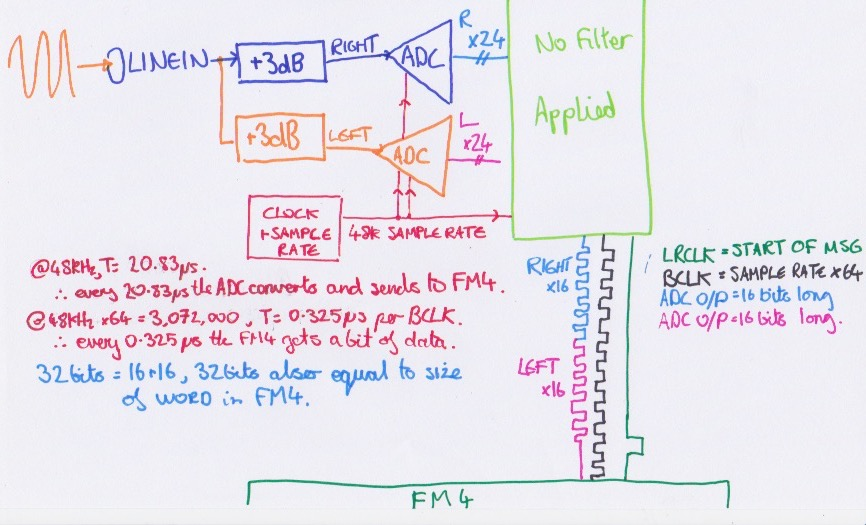

#### I2S Communication Mode 

The mode setup above is pretty interesting - it means that it'll take the input signal and output, via a serial connection, the audio data.

In DSP mode the codec can output 32bits per channel, per sample! So if a sample happened every 32 seconds, a bit would be sent to the FM4 every half a second (because there is a Left and a Right channel) `32 seconds / 64 bits = 1/2`. The start of each set of 64 bits is signaled by a pulse on the `LRCLK` line. And a bit is read by the FM4 on every rising edge of the `BLCK` line.

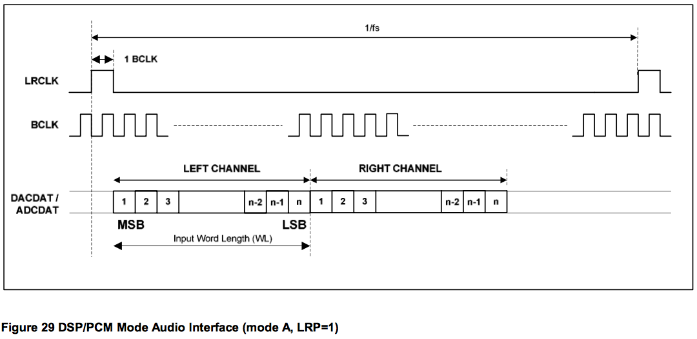

Lets recap that - 64 bits of data need to be sent per sample of the input signal. So it follows that the BLCK needs to be 64 times the frequency of the sample rate. This is confirmed by the datasheet p35 which says that

> In Master mode, DACLRC and ADCLRC will be output with a 50:50 mark-space ratio with BCLK output at 64 x base frequency (i.e. 48 kHz).

In the FM4 the word size is 32 bits so it's actually pretty convenient to only get 32 bits from the ADC in total. `32/2 = 16 bits per channel`. This **doesn't change the speed of `BCLK`**, and the remainging 32 bits on the are packed with `0`s.

### I2S FM4 Peripheral Setup

#### Pins

Now that the control interface to the codec, and the codec's I2S settings are sorted we need to sort out the FM4. The bit what receives the data from the codec.

If I consult the schematic I can see that the I2S pins are connected to something called `I2SCK_0 I2SDO_0 I2SDI_0 I2SWS_0` so my guess is that it's the I2S peripheral number 0.


| Function | Pin | Port/Pin |
| ---| --- | --- |
| I2SDO | 42 | 5:E |
| I2SWS | 43 | 5:F |
| I2SMCLK | 41 | 5D |
|I2S DI | 24 | 3:0 |
| I2SCK | 25 | 3:1 |

And in the [serial datasheet](http://www.cypress.com/file/222976/download) and the [peripheral datahsheet](http://www.cypress.com/file/222996/download) a `ctrl-f` for `I2SDO0` yields some results. 

In the same way as setting up the I2C above the [i2s setup](example_project/i2s.c) sets those pins to use their peripheral function, and then enabled that peripheral function as well using the **PFR** and **EPFR** registers.

> ```c
> // Pin configuration
> FM4_GPIO->EPFR24 |= (1ul << 2ul);    // I2S0-MCLK pin to input
> bFM4_GPIO_PFR5_PD = 1u;
>
> FM4_GPIO->EPFR24 |= (1ul << 10ul);   // I2S0-DO pin to output
> bFM4_GPIO_PFR5_PE = 1u;
>	
> FM4_GPIO->EPFR24 |= (1ul << 8ul);    // I2S0-DI pin to input   
> bFM4_GPIO_PFR5_PE = 1u;
>
> FM4_GPIO->EPFR24 |= (1ul << 4ul);    // I2S0-CK pin to input/output (input used)
> bFM4_GPIO_PFR3_P1 = 1u;
>
> FM4_GPIO->EPFR24 |= (1ul << 6ul);    // I2S0-WS pin to input/output (input used)
> bFM4_GPIO_PFR5_PF = 1u;
> ```

#### I2S Setup

Now that the pins are setup for the peripheral the actual peripheral itself needs to be setup, to match those settings we sent to the codec above. Going through the example project. Since the MFS is being used already we will be using the I2C dedicated peripheral.

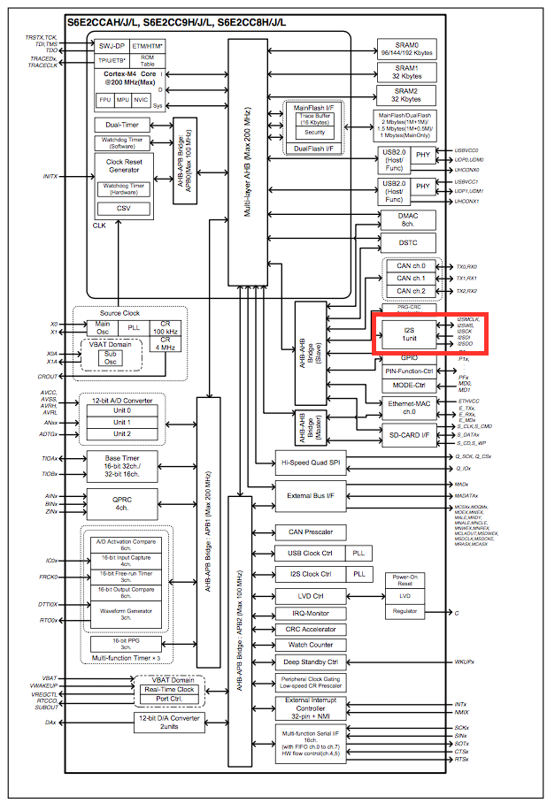

The first setting is to turn off the I2S clock - remember how the codec is providing the clock. Again, searching through the datasheet for the serial comms the _I2S Clock Control Register_ comes up, and in it bit 0 `I2SEN` controls this.

> ```c   bFM4_I2SPRE_ICCR_ICEN =0u;	// Disables I2S MCLK output. The clock will be generated by the CODEC.```

I used used my calculator to check that the memory location which `bFM4_I2SPRE_ICCR_ICEN` points to is this bit - it is `0x427A0000`.

While configuring the I2S stop all the Tx and Rx operations using the `OPREG` or _Operation Control Register_ detailed in Chapter7-2 section 6.7 of the communications datasheet.

> ```c FM4_I2S0->OPRREG_f.START = 0u;       // Stops the I2S interface while configuring. ```

The next thing is that the since the codec is providing out `MCLK` we need to set the FM4's I2S `MCLK` source to the correct frequency using the I2S `CNTREG` (Control register not Cunt register!) `CKRT` bits.

> ```c FM4_I2S0->CNTREG_f.CKRT  = 0u;       // 0: Bypass: Use Wolfson clock ```
### Resources
* [DSP Mode](http://www.nxp.com/assets/documents/data/en/application-notes/AN3664.pdf)
* [Codec Datasheet](https://www.rockbox.org/wiki/pub/Main/DataSheets/WM8731_8731L.pdf)