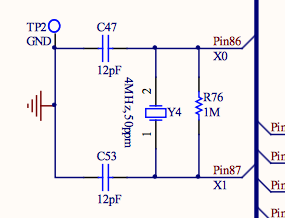
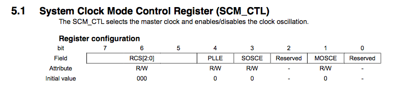
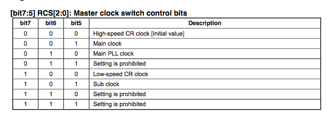
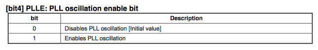
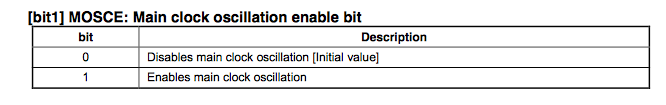

# Clocks

The clocks on the S6E2CC are really configurable so I thought I'd do some looking into them. There are somethings to take into consideration for the clock set up:

1. The max speed of the device.
* 200MHz for mine.
2. The max speed of the busses in the device.
* APB0 = 100MHz
* APB1 = 200MHz
* APB2 = 100MHz
* above info from the [Block Diagram on p79]
3. The speed of the crystal soldered to the development kit.
* The dev kit I have has a 4MHz crystal connected to pins X0 and X1.



There are also *loads* of different clocks avaible, most of which derive from the master clock. 

## Master Clock

Master clock options:

| Description | Datasheet name |
| --- | --- |
| The crystal frequency attached to X0 and X1 | Main Clock |
| The alternative crystal frequency attached to X0A and X1A | Sub Clock |
| Output of a CR oscilator | High Speed CR Clock |
| Output of a CR oscilator | Low Speed CR Clock |
| Out put of the PLL Oscillation Circuit | Main PLL Clock |

Since I have only 4MHz on X0 and X1, and my alternative crystal is 32kHz for the onboard RTC the first two options are pretty naff! Using a CR Oscillator isn't that reliable either due to temperature fluctuations affecting the actual values of the components so PLL seems like the best way of using my FM4's 200MHz advertised speed!

To enable this I need to set the master clock to PLL Clock as enabled, PLL Clock as the course and the Main Clock Oscillation enabled.



In this register these are the bits that matter:



So my desired value here is `SCM_CTL = 0b010?_????`



I can add to the previous value and will get `SCM_CTL = 0b0101_????`



I can add to the previous value and will get `SCM_CTL = 0b0101_??1?`

The rest of the values set to `0` as I don't want the features activated. This means that `SCM_CTL = 0b01010010 = 0x52`.

Once I have selected my clock source I need to pay attention to the `base clock prescaler register` and ensure that **no prescaling** is active otherwise my carefully thought through 200MHz from the PLL will become 100Mhz, or less.

`BSC_PSR = 0x00`


### PLL Circuit Configuration

The Phase Locked Loop (I think) circuit uses the Main Clock input and a series of pre and post scales to generate a higher speed output clock. Luckily the [Peripheral Manual page 47](http://www.cypress.com/file/222996/download) provides a table to tell me to configure these values to 

```
N = 50, M = 2, K = 1
```

It also says to use PLL_CTL2 and PLL_CTL1 to change these values, a quick `ctrl-f` of these quickly gets to page 71 of the same document.

>> PLL_CTL1
>> 
>> Bit#7-4 : PLLK[3:0]
>>  - 0 = Division(PLLK) = 1/1 (default)
>>  - 1 = Division(PLLK) = 1/2
>>  - 2 = Division(PLLK) = 1/3
>>  - . . .
>>  - 15 = Division(PLLK) = 1/16
>> 
>>  Bit#3-0 : PLLM[3:0]
>>  - 0 = Division(PLLM) = 1/1 (default)
>>  - 1 = Division(PLLM) = 1/2
>>  - 2 = Division(PLLM) = 1/3
>>  - . . .
>>  - 15 = Division(PLLM) = 1/16

So I need `0b0000_0001` in `PLL_CTL1`

>>  PLL_CTL2
>> 
>>  Bit#7-6 : (reserved)
>> 
>>  Bit#5-0 : PLLN[5:0]
>>  - 0 = Division(PLLN) = 1/1 (default)
>>  - 1 = Division(PLLN) = 1/2
>>  - 2 = Division(PLLN) = 1/3
>>  - . . .
>>  - 63 = Division(PLLN) = 1/64

And a value of `0bX011_0001` in `PLL_CTL2`

## Bus Speeds

According to my [Block Diagram on p79] I need to set the internal busses to different speeds! This is achieved using the APBCx_PSR, or APB Clock x Prescaler. Since they use the 200MHz master clock as an input I need to make sure that the prescaler gives the correct output.

| Bus Number 	| Max Speed |Prescaler  | Register Functions 	| Register Value| Output Speed |
| --- 			| --- 		| --- 		| --- 					| --- 			| --- |	
| 0 			| 100MHz	| Half		| None 					| 0x01			| 100MHz |
| 1 			| 200MHz	| None		| Enable Prescaler 		| 0x80 		    | 200MHz |
| 2 			| 100MHz	| Half		| Enable Prescaler 		| 0x81 			| 100MHz |

As a result I have the device setup with **200MHz Main Clock, all internal busses to their maximum speeds!** *__ZOOM!__*

### Resources

* [Block Diagram on p79](http://www.cypress.com/file/235126/download)