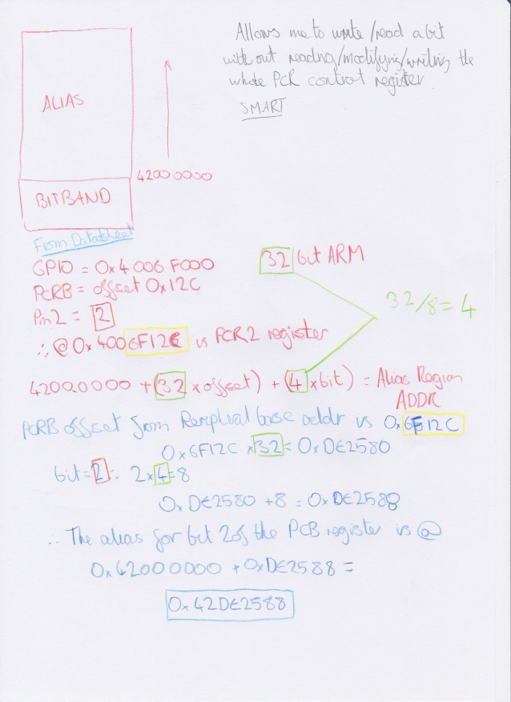

# Using GPIO

Using the GPIO on the FM4 is actually pretty cool because of 2 things:
1. The PDL
2. Bit banding

Note: Remember that the FM4 uses a 32 bit ARM core, 32 bits = 4 bytes = **1 word**.

## Bit Band Alias Region
The ARM Core provides an abstraction which prevents me having to do fancy stuff to change the state of a bit in a word. Usually I'd have to do something like this:

```c
//Get the register
uint32_t temp = TARGET_REGISTER;

//Change the bit
temp |= 0x01 << BIT_NUM;

//Put it back
TARGET_REGISTER = temp;
```
which is of course a pain in the arse - not only is it lots of extra lines of code it will slow the execution down. So a Bit Band Aliasing Region is given, according to the device memory map between addresses `0x4200_0000` and `0x4400_0000`. This does some clever stuff with the system control logic which means that the LSB of each word maps to a bit in the peripheral device region. 

This is also a direct mapping, so the first LSB will map to the first bit of the first register in the peripheral region. 


This means that we can calculate the correct memory address to use by doing:

```
alias_region_base_addr + (word_width * offset_into_peripheral_region) + ((word_width/8) * bit) = alias_region_address_to_use
```

Using values from the FM4 to use the GPIO_PCRB register bit 2 (controlling the state of the GPIO Pull Ups on PortB, Bit 2)

```
alias_region_base_addr = 0x4200_0000
word_width = 32 
offset_into_peripheral_region = 0x6F12C (GPIO base address + offset for PCRB)
word_width/8 = 4
bit = 2
0x4200_0000 + (32*0x6F12C) + (4*2) = 0x42DE2588

```


I can confirm this using the PDL device file `s6e2ccxj.h` which says on line 68767 `#define bFM_GPIO_PCRB_P2 *((volatile  uint8_t *)(0x42DE2588UL))`

## PDL Abstraction

Finding my way through the PDL library was surprisingly easy using tools like Sublime which show where something is defined.


And it means that by defining in my `mcu.h` file the location of the devices' memory map (`s6e2ccxj.h`) and the devices' IO (`gpio_s6e2ccxj.h`) it will automatically complete macros and insert memory locations without me having to know them in the user code. 


This means that rather than having to code something like

```c
// set the bit in the Port B pin 2 pup register
0x42DE2588 = 1; 

//other init ...

```
I can simply call:

```c
Gpio1pin_InitOut(GPIO1PIN_PB2, 1);
```

And the PDL layers handle all the setup and using macros to get the memory locations to write to. In the case of the the function above it also does some disabling of the analogue features on that pin! Easy compared to a P16F877a


### Resources:
https://spin.atomicobject.com/2013/02/08/bit-banding/

http://infocenter.arm.com/help/index.jsp?topic=/com.arm.doc.dai0179b/CHDJHIDF.html

http://infocenter.arm.com/help/index.jsp?topic=/com.arm.doc.ddi0439b/Behcjiic.html
