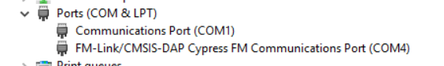
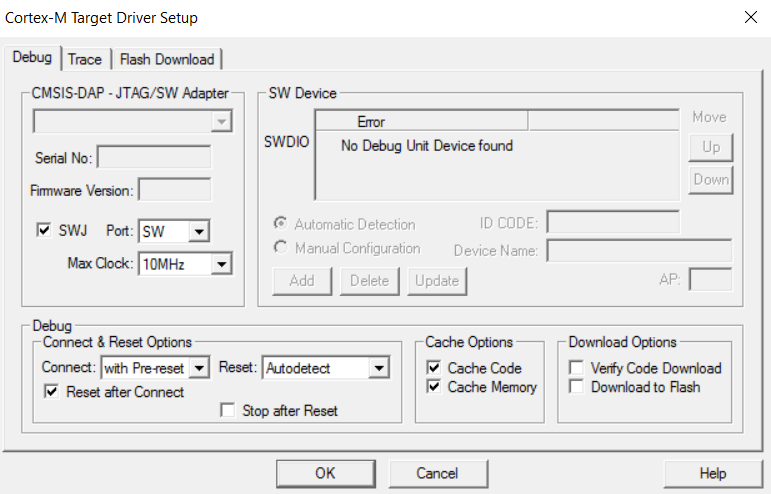
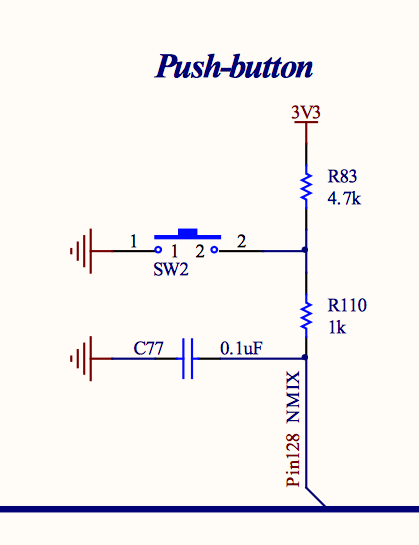
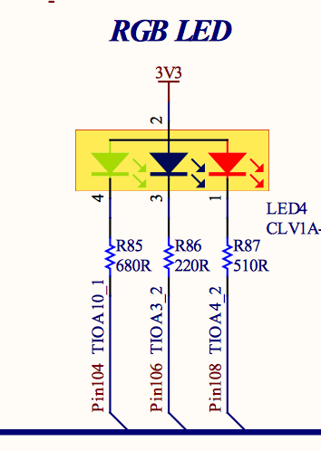
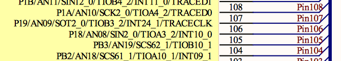

# FM4 Setup
As part of a project at uni I got my hands on a cool [FM4 development kit from Cypress.](http://www.cypress.com/documentation/development-kitsboards/fm4-176l-s6e2cc-eth-arm-cortex-m4-mcu-starter-kit-ethernet-and)


So I thought I'd have a go at playing around with device driver development on it. My home setup is as follows:
* macOS Sierra
* VMWare Fusion Professional Version 8.5.6 (obtained through educational license)
* Windows 10 32-Bit (Education licence) running the the VM

At uni it was easy - plug it into windows and flash the board using Keil uVision 5, so it should be easy at home, right?! 

## Problem 
First off I downloaded and installed all the drivers and software from the FM4 link at the top. I then downloaded and installed Keil uVision 5 (the free evaluation version).

When I plugged my board in I could see it in Windows device manager on COM4, but not in my Keil project debugger menu which was pretty odd.




First I thought I didn't have the right drivers or something, so I did a tonne of googling and trying out different CMSIS-DAP drivers but this was basically a waste of time since nothing worked


I even asked for support on the Cypress Forums, this was actually pretty useful because I learned the different ways of flashing an application to the board. However since I could get Keil to see the boards' debugger it didn't help me out. With the help of someone from uni who got his running I found out that it was to do with the VM!

## Solution
I used Boot Camp to partition my hard drive to give me 100GB, on which I installed Windows 10 **64**-Bit (Education Licence). Then I installed the drivers from the Cypress link and Keil uVision 5. 

I updated the packs in Keil for the FM4_DFP, the CMSIS Core and the MDK Middleware (this was instructed by Keil at startup). I also installed the **P**eripheral **D**river **L**ibrary from Cypress.

## Problem
In the PDL there are no examples for the board I have (the FM4 S6E2CC Pioneer Kit) so I had to learn how to navigate the PDL source tree and use the PDL to make a blinky *Hello World* application. 

## Solution
The folder `devices/fm4/s6e2cxj/mdk` (the S6E2CCAJO being the target device on my board) has a Keil template project! Winner winner chicken dinner. 

### Hello World Program
All I wanted to do was to turn a light on at the press of a button. This is a good test because it means I get familiar with:
* The PDL
* The board schematics
* The GPIO

So I looked at the [board schematics](http://www.cypress.com/file/290921/download) and saw that I have a built in pin called SW2 attached to the devices' Pin128 (P20) 




and an RGB LED attached to PB2, P1A and P18.




I opened the template project in Keil and changed the `../main.c` file to be as follows:

```c
#include "mcu.h"
#include "gpio.h"

int main(void)
{
    int pb;
    /* Initialize Port 2 Pin 0 to be an input pin, with resistive pull up.
    * P20 is connected to the onboard user switch button.
    */
    Gpio1pin_InitIn(GPIO1PIN_P20, Gpio1pin_InitPullup(1u));;
    
    /* Initialize Port B Pin 2 and P18 to be output pins, with initial level high.
    * PB2 controls green colour of the onboard RGB LED,
    * P18 controls blue colour of the onboard RBG LED.
    */     
    Gpio1pin_InitOut(GPIO1PIN_PB2, Gpio1pin_InitVal(1u));
    Gpio1pin_InitOut(GPIO1PIN_P18, Gpio1pin_InitVal(1u));
    
    pb = 0;
    
    while(1)
    {
      /* Copy the state of the input pin to the output pin */
			pb = Gpio1pin_Get(GPIO1PIN_P20);
      Gpio1pin_Put(GPIO1PIN_PB2, Gpio1pin_Get(GPIO1PIN_P20) );
			Gpio1pin_Put(GPIO1PIN_P18, pb );
    }
}
```

Note: There is some weird stuff with the green/blue colours but that's so that when I was debugging I could step through and see the difference.

## Problem 
Building this project gives linker errors. I can't remember the *exact* error message but it was something to do with no finding the gpio.c file. 

## Solution
Go into the project's linker settings and add to the includepath the `drivers/gpio` directory in the PDL source tree.

## Problem 
When loading to the board no 'Algorith for RAM' specified and the CMSIS-DAP fails to load the code on.

## Solution 
In target options > debugger make sure that CMSIS-DAP is selected. In it's settings make sure the 32kb algorithm for `0x1FFD0000 - 0x1FFD0DDF` (0x670 long) is selected.
Start of the RAM for Algorithm is `0x2003C00` size = `0x1000`. 

I WILL INVESTIGATE THIS AND THE MEMORY MAP AT A LATER POINT.

# Loading to Board
Click on the 'Start/Stop' Debugging option in Keil - this will trigger a download of the generated .hex file into the boards' RAM. After this I could press SW2 and see the LED turn on. 
