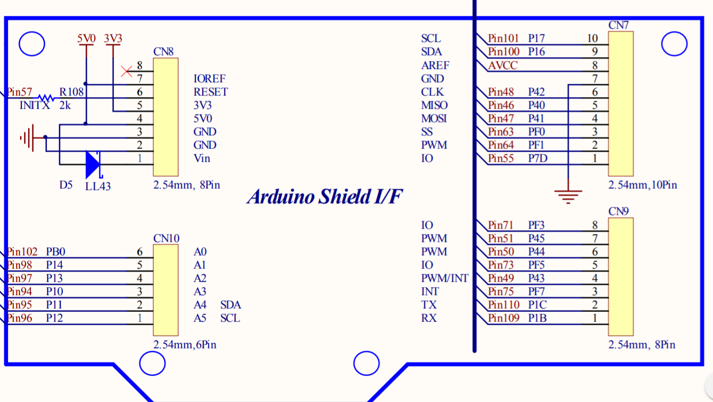
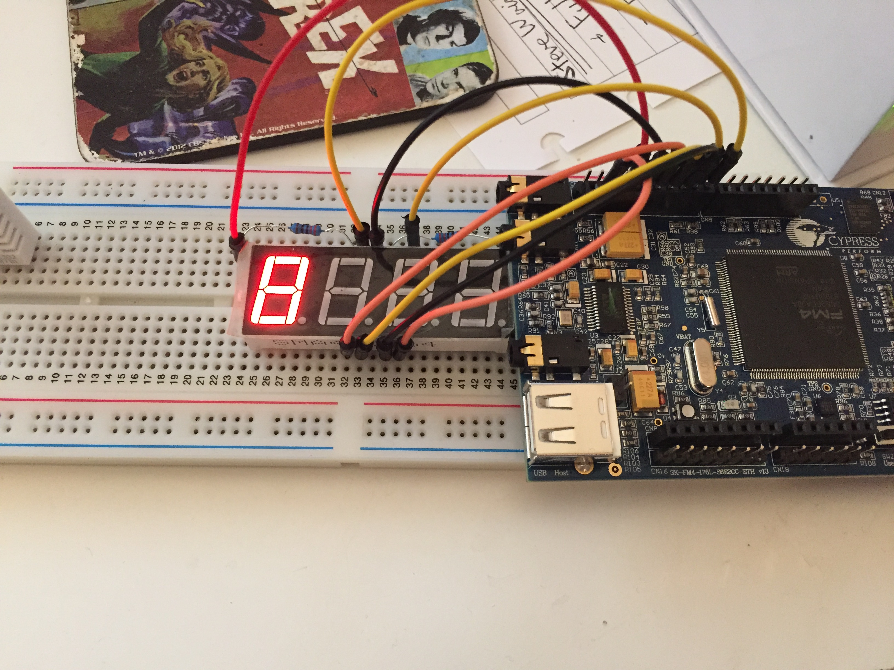
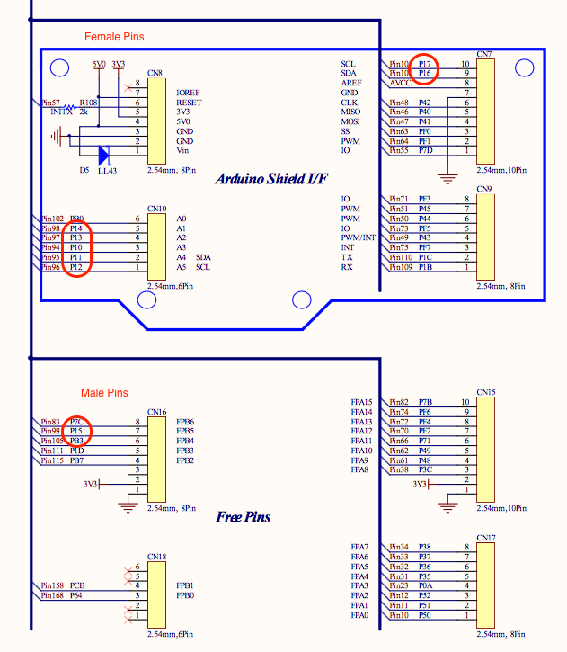
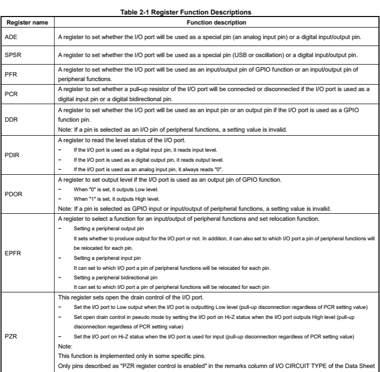
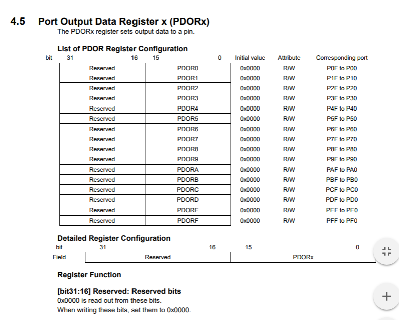
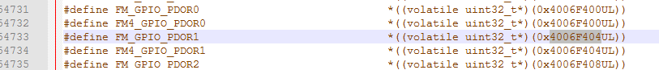

# Using a Seven Segment Display

As part of a project I want to output some letters/numbers on a 7 Segment Display. I just so happen to have one of these laying around so thought I'd give it a go! 


It also happens that there is an arduino guide for it [here](http://haneefputtur.com/7-segment-4-digit-led-display-sma420564-using-arduino.html)

## First Steps



The first thing I did was to plug the segment controls into CN7 pins on the dev kit. I also grounded the `d1` cathode. This means that when I set the relevant pins of the FM4 to be `HIGH` output all of the bits of the display will turn on. 

``` c
int main(void)
{
	// All segments on
	Gpio1pin_InitOut(GPIO1PIN_P16, Gpio1pin_InitVal(1u));
	Gpio1pin_InitOut(GPIO1PIN_P42, Gpio1pin_InitVal(1u));
	Gpio1pin_InitOut(GPIO1PIN_P40, Gpio1pin_InitVal(1u));
	Gpio1pin_InitOut(GPIO1PIN_P41, Gpio1pin_InitVal(1u));
	Gpio1pin_InitOut(GPIO1PIN_PF0, Gpio1pin_InitVal(1u));
	Gpio1pin_InitOut(GPIO1PIN_PF1, Gpio1pin_InitVal(1u));
	Gpio1pin_InitOut(GPIO1PIN_P7D, Gpio1pin_InitVal(1u));
	   
    while(1)
    {
    }
}
```

And my output:



# Controlling It
With the 7 segement display I want to make somethings appear, `1`, `2`, `3`, ... and so on. And to make a segment turn on, using my __common cathode__ display I need to make the input to it `HIGH`. To make a 1 appear I need to have segments `b` and `c` on, and the rest off, for example. I made a table to help me with this:

| Segment | Pin | Port/Pin | Display `1` | Display `2` | Display `3` |Display `4` |Display `5` |Display `6` |Display `7` |Display `8` |Display `9` |Display `0` |
| --- | --- | --- | --- | --- | --- | --- | --- | --- | --- | --- | --- | --- |
| a | 55| 7D | LOW  | HIGH |HIGH |LOW |  HIGH |HIGH |HIGH |HIGH |HIGH |HIGH |
| b | 64| F1 | HIGH | HIGH |HIGH |HIGH | LOW  |LOW  |HIGH |HIGH |HIGH |HIGH |
| c | 63| F0 | HIGH | LOW  |HIGH |HIGH | HIGH |HIGH |HIGH |HIGH |HIGH |HIGH |
| d | 47| 41 |  LOW |  HIGH| HIGH| LOW|   HIGH| HIGH| LOW |HIGH |HIGH |HIGH |
| e | 46| 40 |  LOW |  HIGH| LOW | LOW |  LOW | HIGH| LOW |HIGH |LOW  |HIGH |
| f | 42| 42 | LOW  | LOW  |LOW  |HIGH  | HIGH| HIGH|LOW  |HIGH |HIGH |HIGH |
| g | 100| 16| LOW  | HIGH |HIGH |HIGH | HIGH |HIGH |LOW  |HIGH |HIGH |LOW  |

To practice this I setup the [Dual Timer](../timer/index.md) to generate an interrupt, in this interrupt I change the digit shown. Here's an example of how a digit is shown:

``` c
void show_six( void ){
	Gpio1pin_Put( GPIO1PIN_P7D, 1u );
	Gpio1pin_Put( GPIO1PIN_PF1, 0u );
	Gpio1pin_Put( GPIO1PIN_PF0, 1u );
	Gpio1pin_Put( GPIO1PIN_P41, 1u );
	Gpio1pin_Put( GPIO1PIN_P40, 1u );
	Gpio1pin_Put( GPIO1PIN_P42, 1u );
	Gpio1pin_Put( GPIO1PIN_P16, 1u );
}
```

And here's how the Timer interrupt makes the change:

```c
void DT_IRQHandler(void){
	  static int timer_count = 0;
    Dt_ClrIrqFlag(DtChannel0);    /* Clear Irq */
		switch(timer_count){
			case 0: show_zero(); timer_count++; break;
			case 1: show_one(); timer_count++; break;
			case 2: show_two(); timer_count++; break;
			case 3: show_three(); timer_count++; break;
			case 4: show_four(); timer_count++; break;
			case 5: show_five(); timer_count++; break;
			case 6: show_six(); timer_count++; break;
			case 7: show_seven(); timer_count++; break;
			case 8: show_eight(); timer_count++; break;
			case 9: show_nine(); timer_count = 0; break;
			default: timer_count = 0; break;
		}	
}
```

The full code can be found [here](count_loop.c)

And this is the output:


This means I can successfully use the Dual Timer and the 7 segment display. Though it's not that easy to used cause there's lots of repeatition in the code and in setting the digits up.

## Improvements

### Port Usage

One way to improve the code is to reduce the number of `Gpio1pin_Put` uses and instead use portwise instructions instead. So lets find a port which can be used!



It just so happens that Port 1 has 8 pins exposed via the FM4's spare pins so lets use Port1. The next thing I need to know how to do is to condense this bit of code 

```c
Gpio1pin_Put( GPIO1PIN_P17, 1u );
Gpio1pin_Put( GPIO1PIN_P16, 0u );
Gpio1pin_Put( GPIO1PIN_P15, 1u );
Gpio1pin_Put( GPIO1PIN_P14, 1u );
Gpio1pin_Put( GPIO1PIN_P13, 1u );
Gpio1pin_Put( GPIO1PIN_P12, 1u );
Gpio1pin_Put( GPIO1PIN_P11, 1u );

```

Since they are on the same port I assumed that the PDL would offer some kind of function to write to the port instead of individual bits. I did some googling an found that in v1.0 of the PDL a `GpioPut( port )` function was provided however it seems that in version 2.1.0 this has been removed. The options seem to be as follows: 

1. Write a generic function to add to the PDL which is portable. 
2. Look at the datasheet and write to the FM4 specific address for `Port1`.
3. Probably something else, let me know if I've missed something.

My choice of the above is number 2: Look at the datasheet and write to the FM4 specific address for `Port1`.



Table 2-1 in the peripheral datasheet above shows that the __PDOR__ register determines the state of the output pin.

There is also a __PDOR1__ register listed:



I can find out which address this is at by using the `GPIO Base Address` and the register's offset.

```
Base_Address = 0x4006_F000
PDOR1 Offset = 0x404
PDOR1 Address = 0x4006_F404
```

I can confirm this by looking at the [system description file](code/s6e2ccxj/common/s6e2ccxj.h), where it's handily defined as `FM4_GPIO_PDOR1`:



### Bit Masks

Being able to write to a whole port using the `FM4_GPIO_PDOR1` is pretty cool, but it means that the table above needs to be converter to a set of bits to put in the `PDOR1` register. This is how I will use it

| __PDOR1 Bit__ | 15 | 14 | 13 | 12 | 11 | 10 | 9 | 8 | 7 | 6 | 5 | 4 | 3 | 2 | 1 | 0 |    |
| __ Segment__  |  x | x  | x  | x  | x  | x  | x | x | x | g | f | e | d | c | b | a |Sum(hex) |
| ---			| ---|--- |--- |--- | ---| ---|---|---|---|---|---|---|---|---|---|---| ---|
|Zero 			|  x | x  | x  | x  | x  | x  | x | x | x | 0 | 1 | 1 | 1 | 1 | 1 | 1 | `0x3F` |
|One 			|  x | x  | x  | x  | x  | x  | x | x | x | 0 | 0 | 0 | 0 | 1 | 1 | 0 | `0x06` |
|Two 			|  x | x  | x  | x  | x  | x  | x | x | x | 1 | 0 | 1 | 1 | 0 | 1 | 1 | `0x5B` |
|Three			|  x | x  | x  | x  | x  | x  | x | x | x | 1 | 0 | 0 | 1 | 1 | 1 | 1 | `0x4F` |
|Four			|  x | x  | x  | x  | x  | x  | x | x | x | 1 | 1 | 0 | 0 | 1 | 1 | 0 | `0x66` |
|Five 			|  x | x  | x  | x  | x  | x  | x | x | x | 1 | 1 | 0 | 1 | 1 | 0 | 1 | `0x6D` |
|Six			|  x | x  | x  | x  | x  | x  | x | x | x | 1 | 1 | 1 | 1 | 1 | 0 | 1 | `0x7D` |
|Seven			|  x | x  | x  | x  | x  | x  | x | x | x | 0 | 0 | 0 | 0 | 1 | 1 | 1 | `0x07` |
|Eight			|  x | x  | x  | x  | x  | x  | x | x | x | 1 | 1 | 1 | 1 | 1 | 1 | 1 | `0x7F` |
|Nine			|  x | x  | x  | x  | x  | x  | x | x | x | 1 | 1 | 0 | 1 | 1 | 1 | 1 | `0x6F` |