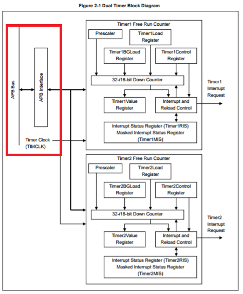

# Using the Timer Interrupt

The FM4 has a heap of timers which I can use:
| Timer | Use |
| --- | --- |
| Watchdog | Watchdog timer, duh! |
| Dual Timer | Counts down and creates an interrupt when 0 is reached. |
| Watch Counter | A 6 bit down counter creates an interrupt at underflow. [Used to wake up uC from a low power mode](http://www.cypress.com/file/318431/download) |
| RTC | Real Time Clock |
| Base Timer | Used to create PWM signals, create a Programmable Pulse, count down from a set value, create a Pulse Width Counter |
| Multifunction Timer | Most motor control stuff |
| Quadrature Position/Revolution Counter | Measuring the encoder position |

For the purposes of a simple delay I'm going to use the Dual Timer. 

## Dual Timer To Create a Delay

The Dual Timer has two channels, and a couple of modes. 

| Mode | Use |
| --- | --- |
| Periodic | Counts down from the `Load Register` value, then counts down from the `Background Load Register` |
| One Shot | Counts down from the `Load Register` value when told to  |
| Continuous/Free-running | Counts down from the maximum everytime |

To create a delay it makes sense that I would like some control over how long to delay for and when to start delaying. This rules out Free-Running mode cause it's not got that control. One shot is pretty good! For the purposes of the [seven segment display](../sevenseg/index.md) though I will want it to count down again, so the Periodic is actually better for this use. 

The datasheet gives a pretty good equation to calculate the value I need to put into the `Load Register`:


So to calculate the correct load value I need to know the following things:
__TIMCLK__ = The block diagram in the datasheet shows that the Dual Timer is connected to the APB bus and it is 100MHz as described [here](../clocks/index.md).



__PRESCALE__ = This is configurable using the PDL provided `stc_dt_channel_config_t.u8PrescalerDiv` struct member.
__Timer Interval__ = I want this to be 1 second.

1 second is quite a high value so I reckon a prescaler of /256 is probably going to be best, so I'll carry on and see what values pop out. 

``` 
Interval = 1sec
PRESCALER = 256
TIMCLKfreq = 100*10^6 
therefore 1 * (100*10^6) - 1 = 390625 - 1 = 390624
```

In terms of setting this up on the FM4, it's pretty simple:

``` c

#define COUNTS_FOR_1_S 390624u
#define COUNTS_FOR_500_MS 195312u


void configure_timer( void ){

  stc_dt_channel_config_t stcDtChannelConfig0;
  stcDtChannelConfig0.u8Mode = DtPeriodic;						// Keep reloading from BG Value
  stcDtChannelConfig0.u8PrescalerDiv = DtPrescalerDiv256;		// 256 Prescale
  stcDtChannelConfig0.u8CounterSize = DtCounterSize32; 			// 32 Bit countdown, but doesnt matter this only counts in free running mode
  stcDtChannelConfig0.bIrqEnable = TRUE;						// Interrupt on 0
  stcDtChannelConfig0.pfnIrqCallback = DT_IRQHandler;			// The callback on interrupt
  stcDtChannelConfig0.bTouchNvic = TRUE;						// Not sure but it was in the example
	
  /* Initialize dual timer channel 0 */
  if (Ok != Dt_Init((stc_dt_channel_config_t*)&stcDtChannelConfig0, DtChannel0))
  {
	Gpio1pin_Put(GPIO1PIN_P1A, 1u); // Light Error LED
      while(1);
  }

  /* Write load value for channel 0 (1sec interval @ PCLK = 100MHz) */
  Dt_WriteLoadVal(COUNTS_FOR_1_S, DtChannel0);
  /* Write background load value for channel 0 (1sec @ PCLK = 100MHz) */
  Dt_WriteBgLoadVal(COUNTS_FOR_1_S, DtChannel0);
  /* Start count for channel 0 */
  Dt_EnableCount(DtChannel0);
}

void DT_IRQHandler(void){
  Dt_ClrIrqFlag(DtChannel0);    /* Clear Irq */
  // My stuff which will happen every second
}

```


# Resources
* [Timer Datasheet](http://www.cypress.com/file/222986/download)