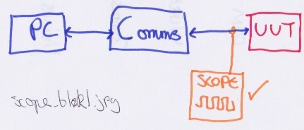

# Comms Investigation

> Since this is for all the world to see (although I doubt that anyone but me will read this!) I will be deliberately vague to avoid breaking IP rules.

> The events described here actually took place over a couple of days, and involved lots of head scratching and cups of tea! Also, I was doing lots of debugging with another engineer, so I can't take all the credit - I have described this all here as if I did it all, but it was an even split of workload between us to get this fixed.

At work I am integrating some equipment, and the jist of it is that I have some __T__ est __E__ quipment that I need to talk to a __U__ nit __U__ nder __T__ est.


The part which I was testing, for the purposes of this page, were the comms to/from the `UUT`.


Which consists of a `PC`, talking to a specialist `comms converter`, which then converts between protocols, and sends to/from the `UUT`.


## Problem 

When talking trying to get the state of a bit in from a reply from the `UUT` I was getting an unexpected, never changing, state. 

### Investigation Pt. 1

The first thing I did was put a breakpoint into the framework I was using to see what was returned from the `comms converter`, before the bit was extracted. This would tell me what the `UUT` was actually saying. At this point I didn't know for sure what I was expecting - but I thought that it'd be useful to gather information about it. 

I looked into the documentation for the comms protocol - looking at the construction of the packets etc to learn what I should expect. I learned that I should expect something like:

> These aren't the actual values, I have put new ones in to illustrate the point!

```
Sent:
0x44, 11, 13 - Header
Rxd:
0x55,11,22 - Header
0x00,00,00,01,00 - Data
```

So I looked back at my gathered results and saw that what the `comms converter` was giving me back was something like:

```
Sent:
0x34, 00, 13 - Header
Rxd:
0xdd, ff ,00 - Header
0x5d, 00, 11, 00, 44 - Data
```

This was *most deffoes* not right. 

## Investigation Pt. 2

The next thing I wanted to do was to split the system down a bit to see where abouts the message is good vs when it's bad. However due to the fact that my TE setup means I'm unable to breakout the `PC` to `comms converter` messages to inspect them I was pretty limited. Instead I stuck an oscilloscope on the Input/Output lines from on the `UUT`. 

Using this I could see that the messages to and from the UUT were as expected! *Weird huh?!*



At the moment there were still a fair amount of components (layers?!) in this setup.

1. The UUT
2. The wires to/from the UUT
3. The Comms converter
4. The wires to the comms converter
5. The communication to the comms converter
6. The way I'm getting the data to/from the COM port on the PC

This leads me onto ...

## Investigation Pt. 3

I wanted to simplify the unknowns so I decided to narrow them down. The first thing I did was to use TeraTerm to talk to the `comms converter`. Using this I could send the message `version?` to get it's version string. 

```
sent: version?
received: version1.26!
```

This small reply proved to me that of my 6 components which might have failed that I could narrow it down to:

1. The UUT
2. The wires to/from the UUT
3. ~~The Comms converter~~
4. ~~The wires to the comms converter~~
5. ~~The communication to the comms converter~~
6. The way I'm getting the data to/from the COM port on the PC

In addition to this I knew that if the message to the `UUT` isn't correct it won't reply to the `comms converter`. This means that in Pt. 2 of the investigation I had proven that the `UUT` is working as expected and that the wires to it and from it are ok.

1. ~~The UUT~~
2. ~~The wires to/from the UUT~~
3. ~~The Comms converter~~
4. ~~The wires to the comms converter~~
5. ~~The communication to the comms converter~~
6. The way I'm getting the data to/from the COM port on the PC

So it must therefore be the way I'm talking to the COM port from my application! 

To confirm this, and double check my discovery about the `comms converter`, I again used TeraTerm to send out the message to the `UUT`:

```
Sent:
0x44, 11, 13 - Header
Rxd:
0xdd, ff ,00 - Header
0x5d, 00, 11, 00, 44 - Data
```

The sent header above is straight from the documentation, however the reply was effectively garbage. This reply is way outside of the expected reply from the communication protocol documentation. Again on the scope I could see that the message between the `comms converter` and the `UUT` was correct!

At this point I'm back to:

1. ~~The UUT~~ (if the UUT wasn't setup correctly then the scope lied)
2. ~~The wires to/from the UUT~~ (if the wires weren't setup correctly then the scope lied)
3. The Comms converter
4. ~~The wires to the comms converter~~ (if the wires weren't setup correctly then the version request wouldn't work)
5. ~~The communication to the comms converter~~ (if the COM port wasn't setup correctly then the version request wouldn't work)
6. The way I'm getting the data to/from the COM port on the PC

## Solution Number 1.

I asked around and no-one had yet encountered a problem with this `comms converter`, but I knew that I had a spare one in a cupboard - so I tried swapping it out to see if that had an effect.

```
Sent:
0x44, 11, 13 - Header
Rxd:
0x55,11,22 - Header
0x00,00,00,01,00 - Data
```

**IT WORKED!** So I did it again just to be sure, and I then sent some different messages to test the response. 

The box wasn't converting correctly!

Using this new box, I plugged in my framework and off I went - but I still had the same problem as at the start: *When talking trying to get the state of a bit in from a reply from the `UUT` I was getting an unexpected, never changing, state.*

However now I could rule out for sure 5 of my 6 variables:

1. ~~The UUT~~ 
2. ~~The wires to/from the UUT~~
3. ~~The Comms converter~~
4. ~~The wires to the comms converter~~ 
5. ~~The communication to the comms converter~~ 
6. The way I'm getting the data to/from the COM port on the PC

So the framework is wrong!

## Investigation Pt. 4

I printed off the documentation and stepped through the layers to check that my data received from the `comms converter` was correct - it was mostly correct but there were some unexpected bits set.

I noticed that there were 4 parts to getting the reply from the `UUT`

1. Send the required header
2. Get the response
3. Get the required byte from the response
4. Get the required bit from the response

So I stepped through each to check that it was as expected by the documentation. 

### Send the required header

This used a bunch of `enum`s and masks to create the header. I noticed that where the message was constructed, the enum used for this message was incorrect. This meant that where I was expecting to have:

```
header = MESSAGE_TYPE_1 | LENGTH | CRC
```

I actually had:

```
header = MESSAGE_TYPE_2 | LENGTH | CRC
```

This is a pretty easy mistake to make when creating loads of fairly repeatative code, and it's a fairly easy fix. However I know that, although the header was created as the wrong message type it wasn't affecting the comms too adversely - I could see on a scope that the `UUT` was replying with the right data so it's nothing ground breaking. 

### Solution 2

Once I changed this I tested the framework by, again, stepping in to look at the memory area in which the received message was stored. This time it was spot on:

```
Sent:
0x44, 11, 13 - Header
Rxd:
0x55,11,22 - Header
0x00,00,00,01,00 - Data
```

### Get the response

No need to check this, since I can see the memory location contains the expected header/data packets.

### Get the required byte from the response

This one was a tricky one to do. In the documentation the comms procotol is explain pretty well using a table like so:

| Byte | Meaning |
| --- | --- |
| 1 | `xxx` |
| 2 | `yyy` |
| 3 | `zzz` |

and the byte I was looking for was `yyy`. So I used the framework function `response_t::get_yyy()`, and stepped into it and saw code something like this:

```c++

enum { XXX_BYTE = 1, YYY_BYTE = 2, ZZZ_BYTE = 3 };
char response_t::get_yyy()
{
	return m_response[ YYY_BYTE ];
}
```

The code above **exactly** matches the documentation. However we all know that data is stored in arrays using **0 based indexing**, which means that this function is actually getting the `zzz` byte out! 

### Solution 3

I changed the function to be something like this:

```c++

enum { XXX_BYTE = 1, YYY_BYTE = 2, ZZZ_BYTE = 3 };
char response_t::get_yyy()
{
	return m_response[ YYY_BYTE - 1 ];
}
```

and the same for the `get_xxx()` and `get_zzz()` functions. I chose not to change the `enum` values since they match the documentation - I instead left plenty of comments to explain this off by one error. 

I again ran the framework and looked at the reply from the function getting the bits and it will wasn't right! By the point I had nearly scratched the skin on my head through to the bone from thinking so much. but I was near the end (of the work day!) at least.

The only remaining variable was ...

### Get the required bit from the response

I had a suspicion that this would be another case of the documentation and code matching exactly. Where the documentation used 1-based indexing the code required 0-based indexing. The documentation described something like:

|bit number | bit 8 | bit 7 | bit 7 | bit 5 |bit 4 |bit 3 |bit 2 |bit 1 |
| bit name | a | b|c|d|e|f|g|h|

Which means that in the framework was a provided function `response_t::is_bit_f_from_yyy_set()`. It looked something like this:

```c++

enum { BIT_A = 8, BIT_B = 7 ... etc ... };
bool response_t::is_bit_f_from_yyy_set()
{
	char rc = get_yyy();
	return (rc & (0x01 << BIT_F)) > 0;
}
```

Working it through using `0xAA` as the return from `get_yyy()`:

```
BIT_F = 3 so shift 3 times
0000_0001 = starting number
0000_0010 = shifted once
0000_0100 = shifted twice
0000_1000 = shifted thrice, and therefore my mask

1010_1010 = return from get_yyy()
0000_1000 = mask calculated above
0000_1000 = result of & operation

0x08 is > 0 therefore return true

```

Above it's clear to see that the function returns true, when actually in `yyy`, bit `f` was **not** set.

### Solution 4

I changed the code above to:

```c++

enum { BIT_A = 8, BIT_B = 7 ... etc ... };
bool response_t::is_bit_f_from_yyy_set()
{
	char rc = get_yyy();
	const int shift = BIT_F - 1;
	return (rc & (0x01 << shift) > 0;
}
```
Again preserving the match with the documentation, and adding a comment to explain why it's changed and different.

I tested this again using every `is_bit_x_of_z()` function and they all responded as expected.

Finally I tested my framework and everything worked as I was expecting it to.

# Summary

- Although the code might match the documentation, the documentation might not work as code!
- Cutting down variabled of what might be wrong was really useful to help nail the real issue.
- There might well be lots of things wrong at once - so making sure to test after you think it's fixed is important.


