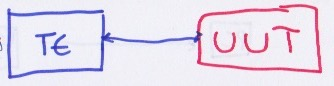

# Comms Investigation

> Since this is for all the world to see (although I doubt that anyone but me will read this!) I will be deliberately vague to avoid breaking IP rules.

> The events described here actually took place over a couple of days, and involved lots of head scratching and cups of tea!

At work I am integrating some equipment, and the jist of it is that I have some __T__est __E__quipment that I need to talk to a __U__nit __U__nder __T__est.



The part which I was testing, for the purposes of this page, were the comms to/from the `UUT`.


Which consists of a `PC`, talking to a specialist `comms converter`, which then converts between protocols, and sends to/from the `UUT`.


## Problem 

When talking trying to get the state of a bit in from a reply from the `UUT` I was getting an unexpected, never changing, state. 

### Investigation Pt. 1

The first thing I did was put a breakpoint into the framework I was using to see what was returned from the `comms converter`, before the bit was extracted. This would tell me what the `UUT` was actually saying. At this point I didn't know for sure what I was expecting - but I thought that it'd be useful to gather information about it. 

I looked into the documentation for the comms protocol - looking at the construction of the packets etc to learn what I should expect. I learned that I should expect something like:

> These aren't the actual values, I have put new ones in to illustrate the point!

```
Sent:
0x44, 11, 13 - Header
Rxd:
0x55,11,22 - Header
0x00,00,00,01,00 - Data
```

So I looked back at my gathered results and saw that what the `comms converter` was giving me back was something like:

```
Sent:
0x34, 00, 13 - Header
Rxd:
0xdd, ff ,00 - Header
0x5d, 00, 11, 00, 44 - Data
```

This was *most deffoes* not right. 

## Investigation Pt. 2

The next thing I wanted to do was to split the system down a bit to see where abouts the message is good vs when it's bad. However due to the fact that my TE setup means I'm unable to breakout the `PC` to `comms converter` messages to inspect them I was pretty limited. Instead I stuck an oscilloscope on the Input/Output lines from on the `UUT`. 

Using this I could see that the messages to and from the UUT were as expected! *Weird huh?!*


At the moment there were still a fair amount of components (layers?!) in this setup.

1. The UUT
2. The wires to/from the UUT
3. The Comms converter
4. The wires to the comms converter
5. The communication to the comms converter
6. The way I'm getting the data to/from the COM port on the PC

This leads me onto ...

## Investigation Pt. 3

I wanted to simplify the unknowns so I decided to narrow them down. The first thing I did was to use TeraTerm to talk to the `comms converter`. Using this I could send the message `version?` to get it's version string. 

```
sent: version?
received: version1.26!
```

This small reply proved to me that of my 6 components which might have failed that I could narrow it down to:

1. The UUT
2. The wires to/from the UUT
3. ~~The Comms converter~~
4. ~~The wires to the comms converter~~
5. ~~The communication to the comms converter~~
6. The way I'm getting the data to/from the COM port on the PC

In addition to this I knew that if the message to the `UUT` isn't correct it won't reply to the `comms converter`. This means that in Pt. 2 of the investigation I had proven that the `UUT` is working as expected and that the wires to it and from it are ok.

1. ~~The UUT~~
2. ~~The wires to/from the UUT~~
3. ~~The Comms converter~~
4. ~~The wires to the comms converter~~
5. ~~The communication to the comms converter~~
6. The way I'm getting the data to/from the COM port on the PC

So it must therefore be the way I'm talking to the COM port from my application! 

To confirm this, and double check my discovery about the `comms converter`, I again used TeraTerm to send out the message to the `UUT`:

```
Sent:
0x44, 11, 13 - Header
Rxd:
0xdd, ff ,00 - Header
0x5d, 00, 11, 00, 44 - Data
```

The sent header above is straight from the documentation, however the reply was effectively garbage. This reply is way outside of the expected reply from the communication protocol documentation. Again on the scope I could see that the message between the `comms converter` and the `UUT` was correct!

At this point I'm back to:
1. ~~The UUT~~ (if the UUT wasn't setup correctly then the scope lied)
2. ~~The wires to/from the UUT~~ (if the wires weren't setup correctly then the scope lied)
3. The Comms converter
4. ~~The wires to the comms converter~~ (if the wires weren't setup correctly then the version request wouldn't work)
5. ~~The communication to the comms converter~~ (if the COM port wasn't setup correctly then the version request wouldn't work)
6. The way I'm getting the data to/from the COM port on the PC

## Solution Number 1.

I asked around and no-one had yet encountered a problem with this `comms converter`, but I knew that I had a spare one in a cupboard - so I tried swapping it out to see if that had an effect.

```
Sent:
0x44, 11, 13 - Header
Rxd:
0x55,11,22 - Header
0x00,00,00,01,00 - Data
```

**IT WORKED!** So I did it again just to be sure, and I then sent some different messages to test the response. 

The box wasn't converting correctly!

Using this new box, I plugged in my framework and off I went - but I still had the same problem as at the start: *When talking trying to get the state of a bit in from a reply from the `UUT` I was getting an unexpected, never changing, state. *
